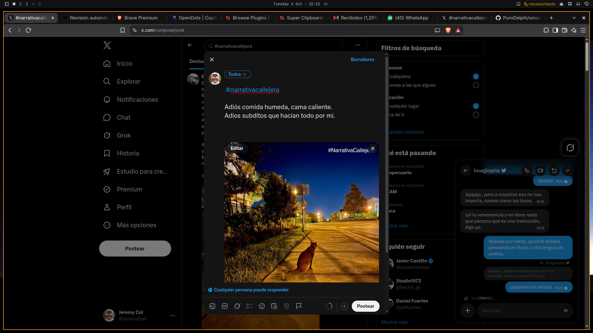
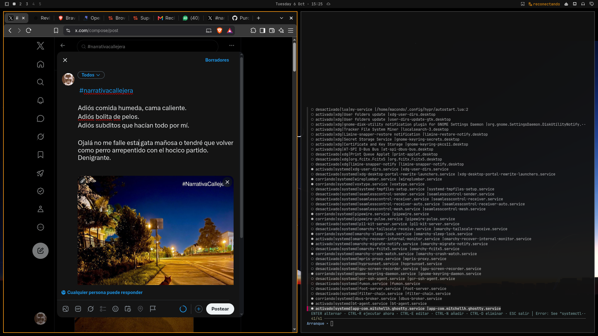
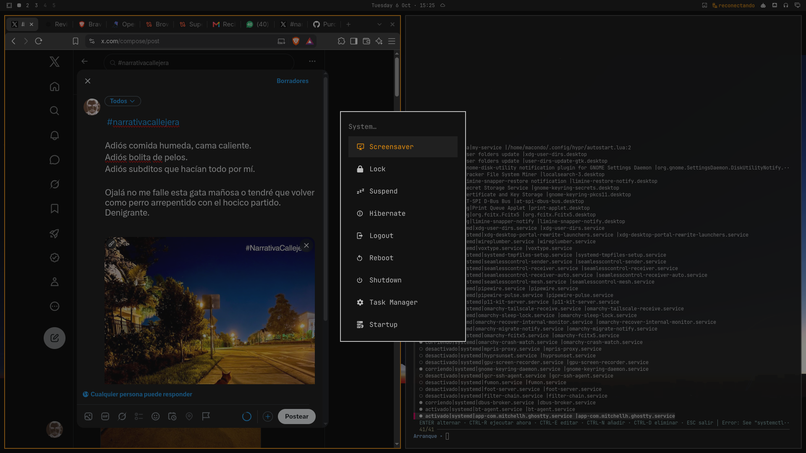

# omarchy-mission-center

Un **Administrador de tareas tipo Windows** para [Omarchy](https://omarchy.org) (Arch + Hyprland):
Mission Center como Task Manager (procesos, red, servicios, rendimiento) + un
gestor de programas de arranque (startup) en terminal, con entradas de menú y
keybinding listos para usar.

| Task Manager (Mission Center) | Startup (startup-manager) |
|---|---|
|  |  |



## Qué incluye

| Pieza | Origen | Descripción |
|---|---|---|
| `mission-center` | repo `extra` | GUI con pestañas: rendimiento (CPU/RAM/disco/red/GPU), **Apps/Procesos con terminar y force-kill**, **Red** (interfaces, IP, velocidad), **Servicios** (systemd) |
| `nethogs` | repo `extra` | Habilita la columna de **red por proceso** en Mission Center (mediante `setcap`) |
| `startup-manager` | este repo | TUI (fzf) que lista y alterna las 3 fuentes reales de arranque de Omarchy: servicios systemd de usuario, autostart XDG (`~/.config/autostart`) y `~/.config/hypr/autostart.lua` |
| Entradas de menú | este repo | `System → Task Manager` y `System → Startup` (buscables: *tareas*, *procesos*, *inicio*, *arranque*) |
| Keybinding | este repo | `SUPER+SHIFT+ESC` abre Mission Center (equivalente al Ctrl+Shift+Esc de Windows) |

## Instalación rápida

En la otra máquina Omarchy:

```bash
git clone https://github.com/PuroDelphi/omarchy-mission-center.git
cd omarchy-mission-center
./install.sh
```

Pedirá tu contraseña para `pacman` y `setcap`. El script es **idempotente**:
puedes ejecutarlo tantas veces como quieras (lo que ya está instalado lo omite).

## Instalación manual (si prefieres los comandos)

```bash
# 1. Paquetes
omarchy pkg add mission-center nethogs

# 2. Red por proceso en Mission Center
sudo setcap "cap_net_admin,cap_net_raw,cap_dac_read_search,cap_sys_ptrace+pe" "$(which nethogs)"

# 3. Gestor de arranque
install -Dm755 bin/startup-manager ~/.local/bin/startup-manager

# 4. Entradas del menú: copiar las líneas de fragments/menu.jsonc dentro del
#    objeto de ~/.config/omarchy/extensions/omarchy-menu.jsonc
# 5. Keybinding: añadir la línea de fragments/bindings.lua al final de
#    ~/.config/hypr/bindings.lua
# 6. Aplicar
hyprctl reload && hyprctl configerrors
```

## Qué archivos toca

| Archivo | Cambio |
|---|---|
| `~/.local/bin/startup-manager` | script nuevo (copia de `bin/startup-manager`) |
| `~/.config/omarchy/extensions/omarchy-menu.jsonc` | +2 entradas (`system.tasks`, `system.startup`) |
| `~/.config/hypr/bindings.lua` | +1 línea (`SUPER+SHIFT+ESC`) |
| sistema | paquetes `mission-center`, `nethogs` + `setcap` en nethogs |

Nada en `/usr/share/omarchy/` (read-only de Omarchy) — todo es configuración de
usuario, seguro ante `omarchy update`.

## Uso

**Task Manager** — `SUPER+SHIFT+ESC` o menú *System → Task Manager*:

- **Apps**: clic derecho → terminar / terminar con fuerza (SIGTERM/SIGKILL, eleva con pkexec)
- **Network**: interfaz activa, IP, velocidad de enlace, tráfico subida/bajada
- **Services**: servicios systemd (activar/desactivar)
- **Performance**: CPU por hilo, RAM/swap/zRAM, disco por partición (SMART), GPU (nvtop), ventiladores
- Columna de **red por proceso** en Apps (gracias a nethogs)
- Atajo útil: `CTRL` pausa la actualización de gráficas para leer valores

**Startup** — menú *System → Startup*:

| Tecla | Acción |
|---|---|
| `ENTER` | Alternar activado/desactivado |
| `CTRL+R` | Ejecutar ahora |
| `CTRL+E` | Editar la fuente (desktop/luа) |
| `CTRL+N` | Añadir programa de arranque |
| `CTRL+D` | Eliminar entrada (con confirmación) |
| `ESC` | Salir |

Las fuentes que gestiona:

1. **Servicios systemd de usuario** — `systemctl --user enable/disable --now`
   (con confirmación extra para servicios críticos como pipewire/wireplumber)
2. **Autostart XDG** — `~/.config/autostart/*.desktop` (anula a `/etc/xdg/autostart/`)
   con `Hidden=true/false`; tras cada cambio hace `daemon-reload` y arranca/para
   la unidad `app-…@autostart.service` generada
3. **`~/.config/hypr/autostart.lua`** — comenta/descomenta `o.launch_on_start(...)`

Tras añadir un programa nuevo con `CTRL+N` queda activo en el próximo inicio de
sesión (y se intenta arrancar al momento).

> Al primer arranque de Mission Center acepta su diálogo de *setup*: habilita
> red por proceso, lecturas de ventiladores y consumo de CPU.

## Desinstalación

```bash
omarchy pkg drop mission-center nethogs
sudo setcap -r "$(which nethogs)" 2>/dev/null || true
rm ~/.local/bin/startup-manager
# Quita a mano las 2 entradas de omarchy-menu.jsonc y la línea
# "-- omarchy-mission-center" + la bind de bindings.lua
```

## Estructura del repo

```
├── install.sh            # instalador idempotente
├── bin/startup-manager   # TUI de arranque (bash + fzf)
├── fragments/
│   ├── menu.jsonc        # entradas del menú (inserción manual)
│   └── bindings.lua      # keybinding (inserción manual)
├── docs/                 # capturas de esta instalación
└── README.md
```

## Licencia

[MIT](LICENSE)
